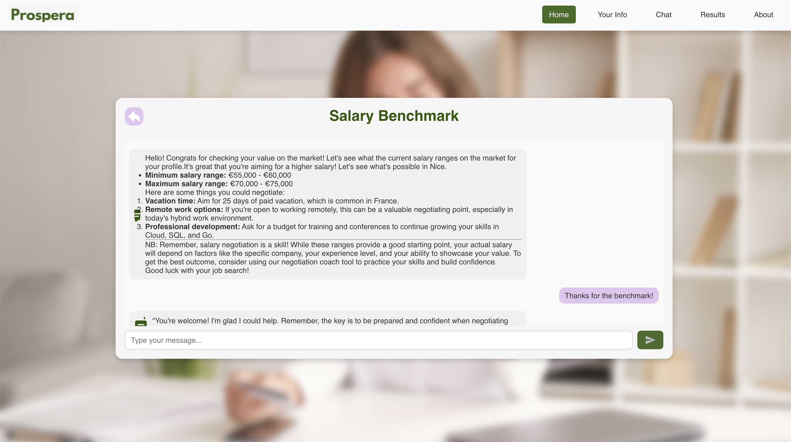
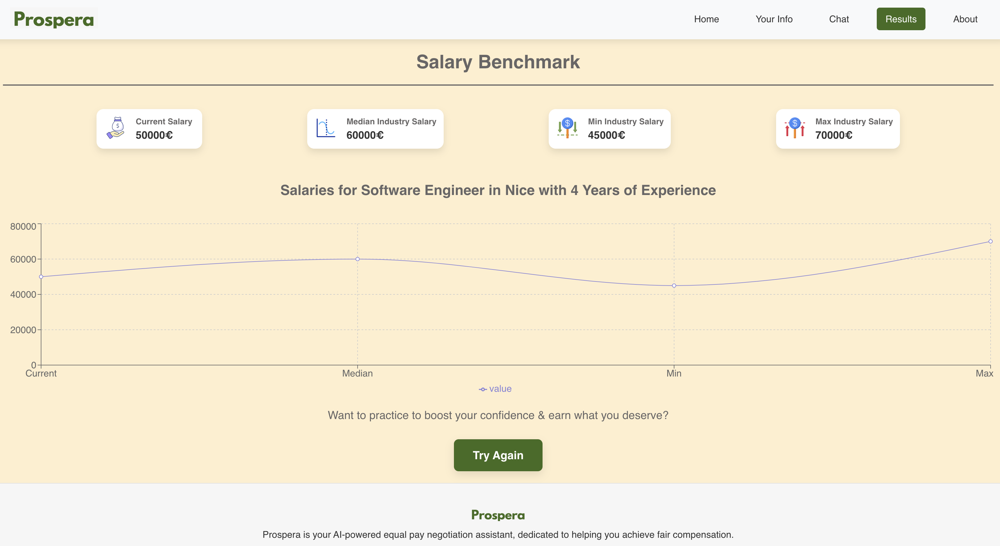
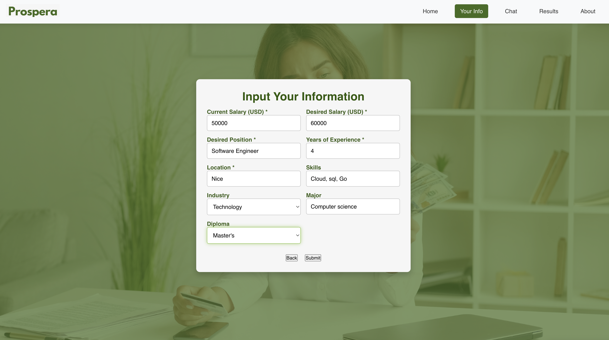
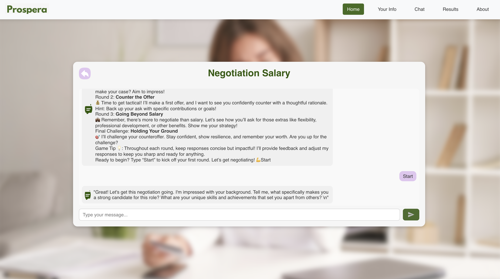
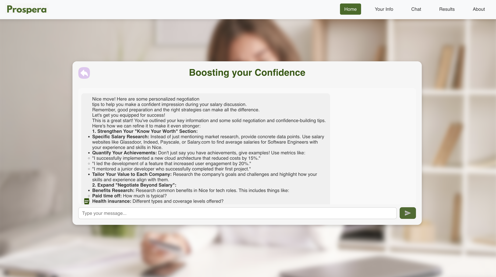
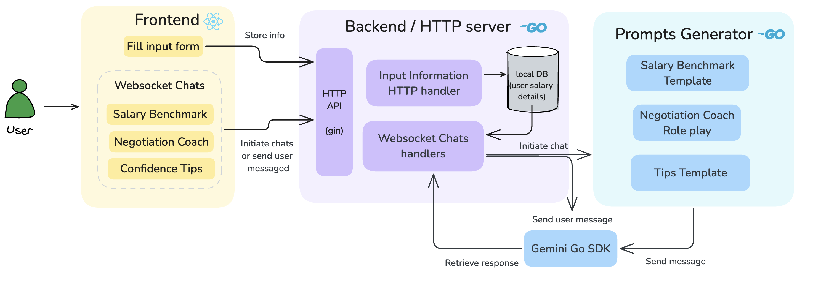
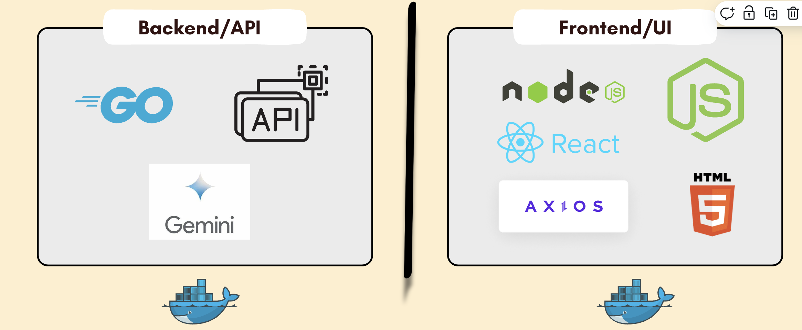

# **Prospera** - Empowering Women in Career Negotiation with AI

Prospera is an AI-driven application designed to help women confidently negotiate salaries and achieve financial equity. Leveraging Google’s Gemini AI, Prospera provides real-time salary benchmarking, personalized negotiation coaching, and career guidance tailored to individual needs and aspirations.





## **Table of Contents**

1. [Prerequisites](#prerequisites)
2. [Installation and Setup](#installation-and-setup)
3. [Usage](#usage)
4. [Testing Prospera](#testing-prospera)
5. [Project Structure](#project-structure)
6. [Built With](#built-with)
7. [Contributing](#contributing)
8. [License](#license)

---
## **Prerequisites**

To get started with Prospera, make sure you have the following installed:

1. **Docker**: Get Docker
2. **Docker Compose**: Verify with `docker-compose --version` (Docker Compose is included with Docker Desktop)
3. **Make**: Installing Make
4. **Google API Key**: Have a [Google API Key](https://aistudio.google.com/app/apikey) and add it to the `.env` file (see below).

## **Installation and Setup**

### 1. Clone the Repository

Clone the repository and navigate into the project directory:

```bash
git clone https://github.com/doniacld/prospera.git
cd prospera
```

### 2. Configure Environment Variables

Prospera requires specific environment variables for API keys and configuration. Follow these steps to set up your environment:

1. Create a `.env` file in the project root:

    ```bash
    cp .env.example .env
    ```

2. Open `.env` and configure the required values:
    ```
    API_KEY=your_google_api_key_here
    ANOTHER_VARIABLE=another_value
    ```


### 3. Running Prospera

### Option A: Run with Docker (Recommended)

To build and run both backend and frontend containers:

```bash
make docker-up
```

To stop the containers:

```bash
make docker-down
```

### Option B: Run Locally Without Docker

To run each service locally, you can use the following commands:

1. **Start the Backend**:

    ```bash
    make run-backend
    ```

2. **Start the Frontend**:

    ```bash
    make run-frontend
    ```

3. **Stopping Services Locally**:

    ```bash
    make kill-local
    ```

---

## **Usage**

Once Prospera is running, you can access the application through your browser:

- **Frontend**: Visit `http://localhost:3000`
- **Backend API**: Available at `http://localhost:8080`

### Features to Explore

- **Salary Benchmarking**: Fill out the input form to receive real-time salary insights.




- **Negotiation Coach Chat**: Engage in a real-time chat to practice negotiation scenarios. 


- **Tips Chat**: Interact with Prospera’s AI-driven coach for personalized advice.


---

## **Testing Prospera**

### Step-by-Step Testing Guide

1. **Input Form**: Use the form on the frontend to input salary details, experience, location, and more. Submit the form to get a salary benchmarking response.
2. **Negotiation Coaching**: Access the negotiation coach to receive interactive guidance. The backend processes responses in real-time using WebSocket, simulating a live conversation.
3. **Chat Interface**: Test the WebSocket functionality by engaging in a back-and-forth conversation with the AI, ensuring seamless real-time responses.

### Viewing Logs

- **Docker logs**: Use `docker-compose logs -f` to monitor backend and frontend logs while testing.
- **Local logs**: When running locally, logs will appear in each terminal window where the backend and frontend are running.

---

## **Project Structure**

Here’s an overview of the main files and directories:

```
plaintext
Copier le code
prospera/
├── app/                   # Go backend
│   ├── main.go            # Backend entry point
│   ├── Dockerfile         # Backend Dockerfile
│   └── ...
├── prospera-app/          # React frontend
│   ├── src/               # React source code
│   ├── Dockerfile         # Frontend Dockerfile
│   └── ...
├── docker-compose.yml     # Docker Compose configuration
├── Makefile               # Makefile for easy setup and testing
├── .env.example           # Example environment file
└── README.md              # Project documentation

```
The full architecture looks like this


---

## **Built With**



- **Go**: Backend API and WebSocket server
- **React**: Frontend UI
- **Google Gemini AI**: AI-driven negotiation assistance
- **Docker & Docker Compose**: Containerized environment for easy deployment
- **Make**: Simplifies running and managing local and Docker environments

---

## **Contributing**

Contributions are welcome! Please follow these steps if you would like to contribute to Prospera:

1. Fork the repository
2. Create a new feature branch (`git checkout -b feature/YourFeature`)
3. Commit your changes (`git commit -m 'Add new feature'`)
4. Push to the branch (`git push origin feature/YourFeature`)
5. Open a Pull Request

---

## **License**

This project is licensed under the MIT License - see the LICENSE file for details.

---

## **Contact**

For any questions or feedback, please open an issue.
